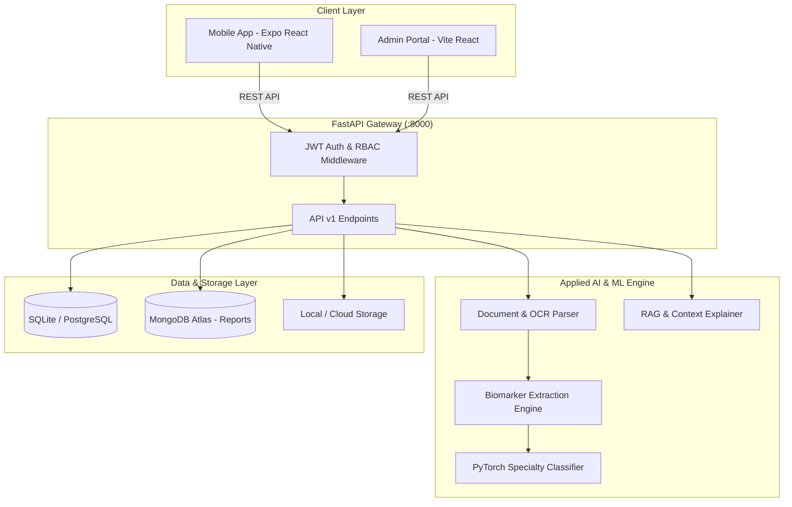

<div align="center">


# VitaLens (AI Health Navigator)
### Applied AI/ML Health Report Analysis & Doctor Recommendation Platform

[](https://www.python.org/)
[](https://fastapi.tiangolo.com/)
[](https://pytorch.org/)
[](https://reactnative.dev/)
[](https://www.typescriptlang.org/)
[](https://tailwindcss.com/)
[](https://opensource.org/licenses/MIT)

*An intelligent, end-to-end clinical workflow system integrating PDF/OCR diagnostic report extraction, PyTorch neural network medical specialty triage, contextual RAG explanations, and verified doctor appointment booking.*

</div>

---

## 📑 Table of Contents
- [Overview](#-overview)
- [Key Features](#-key-features)
- [System Architecture](#-system-architecture)
- [Project Structure](#-project-structure)
- [Tech Stack](#-tech-stack)
- [Quick Start](#-quick-start)
  - [Prerequisites](#prerequisites)
  - [1. Single-Command Launch (Recommended)](#1-single-command-launch-recommended)
  - [2. Platform-Specific Launchers](#2-platform-specific-launchers)
  - [3. Manual Service-by-Service Startup](#3-manual-service-by-service-startup)
- [Pre-Seeded Demo Credentials](#-pre-seeded-demo-credentials)
- [Environment Configuration](#-environment-configuration)
- [API Documentation](#-api-documentation)
- [Machine Learning Pipeline](#-machine-learning-pipeline)
- [Authors & Acknowledgments](#-authors--acknowledgments)

---

## 💡 Overview

**VitaLens** bridges the communication and triage gap between clinical lab diagnostics and patient care. Patients often receive complex laboratory test results (e.g., Complete Blood Count, Lipid Profiles, Liver Function Tests, Thyroid Panels) that cause confusion and anxiety. 

VitaLens automatically extracts numerical biomarkers and reference ranges, flags clinical abnormalities (LOW / NORMAL / HIGH), passes clinical findings and patient symptoms through a trained **PyTorch Neural Network Classifier** to recommend appropriate medical specialties, and facilitates direct scheduling with available doctors.

---

## ✨ Key Features

- 📄 **Intelligent Document & OCR Extraction**: Seamlessly parses digital lab PDFs and scanned report images using regex pattern matching and OCR to capture biomarkers, observed values, and reference ranges.
- 🧠 **PyTorch Neural Specialty Predictor**: Multi-Layer Perceptron trained on clinical symptom-biomarker feature sets that maps abnormalities to relevant medical specialties (Cardiology, Endocrinology, Hematology, etc.).
- 💬 **Contextual Medical Q&A (RAG-Assisted)**: Translates clinical metrics into plain-English patient guidance with built-in medical safety disclaimers.
- 📅 **Doctor Availability & Appointment Scheduling**: Real-time slot booking, consultation status tracking, and doctor profile reviews.
- 📱 **Cross-Platform Mobile App (Expo / React Native)**: Fluid patient experience with interactive biomarker range gauges, trend visualizations, and report histories.
- 🖥️ **Admin & Analytics Portal (React + Vite)**: Centralized management dashboard for doctor verifications, appointment monitoring, and system metrics.
- 🛡️ **Enterprise Security & Multi-Role RBAC**: JWT-based authentication with strict role permissions (`PATIENT`, `DOCTOR`, `ADMIN`).

---

## 🏗 System Architecture



---

## 📁 Project Structure

```
AML_REACT_PROJECT/
├── admin-web/                 # React 18 + Vite Admin Web Dashboard
│   ├── public/                # Static assets & favicons
│   ├── src/                   # TypeScript components, pages & admin API
│   ├── package.json
│   └── vite.config.ts
├── backend/                   # FastAPI Python Microservice
│   ├── alembic/               # Database migration scripts
│   ├── app/
│   │   ├── api/v1/            # Auth, doctors, reports, appointments endpoints
│   │   ├── core/              # Config, security, database, RBAC, storage
│   │   ├── ml/                # OCR, PyTorch model, tokenizer & training scripts
│   │   ├── models/            # SQLAlchemy ORM schemas
│   │   ├── schemas/           # Pydantic validation schemas
│   │   └── services/          # Business logic layer
│   ├── docs/                  # Architecture, RBAC & compliance documentation
│   ├── tests/                 # Pytest test suite
│   ├── .env.example           # Environment template
│   ├── main.py                # Server entrypoint
│   └── requirements.txt       # Python dependencies
├── mobile/                    # Expo React Native Patient Mobile App
│   ├── assets/                # App icons, splash screens & graphics
│   ├── src/
│   │   ├── api/               # API clients with Axios
│   │   ├── components/        # Reusable UI elements & biomarker gauges
│   │   ├── navigation/        # Stack & bottom tab navigators
│   │   ├── screens/           # Auth, Home, Reports, Doctors, Booking
│   │   ├── store/             # Zustand state management
│   │   └── types/             # TypeScript definitions
│   ├── App.tsx
│   └── package.json
├── vitalens-logo-assets/      # Brand identity & logo exports
├── package.json               # Monorepo root scripts & dev orchestration
├── start.bat                  # 1-Click Windows Batch Launcher
├── start.ps1                  # PowerShell Unified Launcher
└── README.md
```

---

## 🛠 Tech Stack

| Domain | Technologies |
| :--- | :--- |
| **Backend API** | Python 3.10+, FastAPI, Uvicorn, Pydantic v2 |
| **Databases** | SQLite (Dev) / PostgreSQL with SQLAlchemy 2.0 Async, Motor (MongoDB Atlas) |
| **AI / Machine Learning** | PyTorch, scikit-learn, PyPDF, pdfplumber, NumPy, Joblib |
| **Mobile Application** | React Native, Expo SDK 51, TypeScript, TailwindCSS / NativeWind, Zustand |
| **Admin Web Portal** | React 18, Vite, TypeScript, Lucide Icons, Axios |
| **Security & Auth** | OAuth2 Password Bearer, JWT (JOSE), Passlib (Bcrypt), RBAC |

---

## 🚀 Quick Start

### Prerequisites
- **Node.js**: `v18.x` or higher ([Download Node.js](https://nodejs.org/))
- **Python**: `3.10` to `3.12` ([Download Python](https://www.python.org/))
- **Expo Go App** (optional, for running mobile app on physical phone): Available on iOS App Store & Android Play Store.

---

### 1. Single-Command Launch (Recommended)

From the project root:

```bash
# 1. Install all dependencies across backend, mobile, and admin
npm run install:all

# 2. Launch Backend, Mobile, and Admin simultaneously
npm run dev
```

#### Additional Root Scripts:
| Script | Action |
| :--- | :--- |
| `npm run dev` | Runs **Backend** (`:8000`), **Mobile** (`:8081`), and **Admin** (`:3000`) concurrently |
| `npm run dev:backend-mobile` | Runs **Backend** and **Mobile** concurrently |
| `npm run dev:web` | Runs Backend and launches **Expo Mobile in Web Mode** |
| `npm run dev:android` | Runs Backend and launches Mobile on connected Android device/emulator |
| `npm run dev:ios` | Runs Backend and launches Mobile on iOS Simulator |
| `npm run test:backend` | Executes pytest test suite |
| `npm run check:types` | Runs TypeScript typechecks on Mobile and Admin |

---

### 2. Platform-Specific Launchers (Windows)

#### Option A: Windows 1-Click Batch (`start.bat`)
Double-click `start.bat` in the project root to open the interactive startup menu.

#### Option B: PowerShell Script (`start.ps1`)
```powershell
# Launch all three services
.\start.ps1

# Launch mobile in web browser mode
.\start.ps1 -mode web

# Launch backend only
.\start.ps1 -mode backend
```

---

### 3. Manual Service-by-Service Startup

If you prefer launching components in separate terminal windows:

#### Terminal 1 — Backend API:
```bash
cd backend
python -m venv venv
# Windows:
.\venv\Scripts\activate
# macOS/Linux:
source venv/bin/activate

pip install -r requirements.txt
python main.py
```
> API runs at: `http://localhost:8000` | Swagger Docs at: `http://localhost:8000/docs`

#### Terminal 2 — Patient Mobile App:
```bash
cd mobile
npm install
npx expo start
```
> Press `w` to open in Web Browser, `a` for Android, or scan the QR code using Expo Go.

#### Terminal 3 — Admin Web Dashboard:
```bash
cd admin-web
npm install
npm run dev
```
> Admin portal runs at: `http://localhost:3000`

---

## 🔑 Pre-Seeded Demo Credentials

The database is automatically pre-seeded with sample accounts for testing all user roles:

| Role | Email | Password | Primary Interface |
| :--- | :--- | :--- | :--- |
| **Patient** | `demo@healthapp.com` | `password123` | Mobile App (`:8081`) |
| **Doctor** | `doctor.jenkins@vitalens.health` | `doctor123` | Mobile / Doctor Endpoints |
| **Admin** | `admin@vitalens.health` | `admin123` | Admin Portal (`:3000`) |

---

## ⚙ Environment Configuration

Copy the sample environment file in `backend/` to initialize local settings:

```bash
cd backend
cp .env.example .env
```

| Key | Description | Default Dev Value |
| :--- | :--- | :--- |
| `DATABASE_URL` | SQLAlchemy async connection string | `sqlite+aiosqlite:///./health_app.db` |
| `SECRET_KEY` | JWT signing secret | Dev secret key (override in production) |
| `STORAGE_PROVIDER` | Report storage (`local`, `imagekit`, `gcs`) | `local` |
| `CORS_ORIGINS` | Permitted client origins | `["http://localhost:8081","http://localhost:3000"]` |

---

## 📖 API Documentation

FastAPI provides self-documenting interactive API interfaces:
- **Interactive Swagger UI**: [http://localhost:8000/docs](http://localhost:8000/docs)
- **ReDoc Technical Specification**: [http://localhost:8000/redoc](http://localhost:8000/redoc)
- **Liveness & Readiness Health Probes**:
  - `GET /health` — Service uptime & database ping
  - `GET /health/ready` — ML model readiness probe

---

## 🧠 Machine Learning Pipeline

1. **Document Ingestion**: Lab test PDFs or image scans are processed via `app/ml/document_parser.py` and `app/ml/ocr_engine.py`.
2. **Entity Extraction**: Normalizes test names (e.g. "Hb", "HGB", "Hemoglobin") against a medical synonym library and extracts numerical values and reference intervals.
3. **Specialty Classification**: The extracted biomarker states combined with patient intake symptoms are fed to the PyTorch neural network (`app/ml/models/specialty_model.pt`) to rank probability scores across clinical specialties.
4. **Contextual Explanation**: Generates layman-friendly summaries explaining what abnormal biomarkers mean and what questions to ask the recommended doctor.

---

## 👤 Author & Acknowledgments

- **Uzair Shaikh**

*Special thanks to academic guides and project faculty for clinical workflow guidance and support.*

---

## 📄 License

This project is licensed under the [MIT License](LICENSE).
