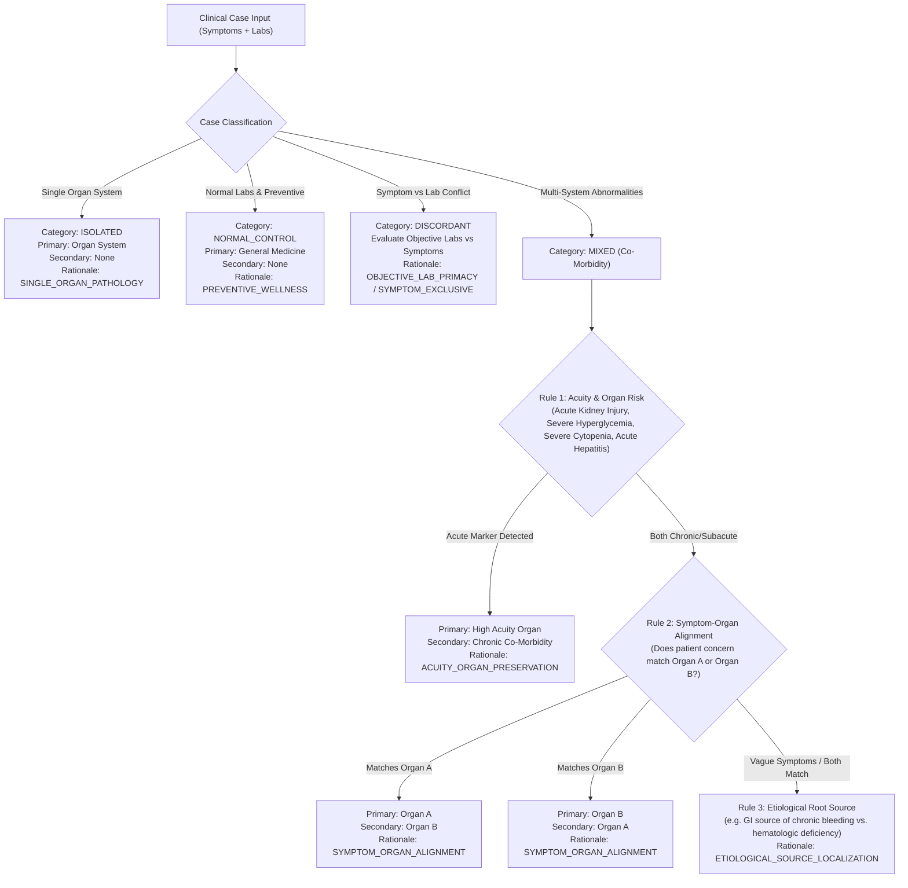

# VitaLens AI Specialty Recommendation Model: V2 Architectural Design & Training Specification

**Document Version**: 2.1.0-REVISED-SPEC
**Date**: October 3, 2026
**Status**: Pre-Training Architectural Specification & Governance Gate
**Author**: VitaLens AI Medical Informatics & Architecture Team

---

## 1. Executive Summary & Design Principles

This specification defines the complete engineering, clinical, and evaluation architecture for **VitaLens Specialty Recommendation Model V2**.

### Core Governance Principles:
1. **Preservation of Production V1**: The production V1 model (`specialty_model.pt`, 298 dimensions), its pipeline (`feature_pipeline.joblib`), metadata, and endpoints remain completely untouched and live in production.
2. **Strict Isolation of V2**: All V2 artifacts, dataset generators, pipelines, checkpoints, and evaluations live in isolated directories (`backend/app/ml/training/*_v2.py` and `backend/app/ml/models/v2/`).
3. **No Overfitting to Report #2**: Report #2 is treated **strictly as an external regression/observational benchmark**. It is NEVER used to tune, bias, generate, or optimize the training dataset toward predetermined outputs.
4. **No Heuristic Overrides**: The model operates purely via deep neural network inference without hardcoded rules, priority routing, or synthetic shortcuts.
5. **Deterministic Multi-Label Transparency**: Every sample in the dataset explicitly logs primary specialty, secondary specialty (if applicable), driver clinical features, and clinical acuity rationale.
6. **Comprehensive Multi-Facet Evaluation**: Evaluates overall accuracy, top-2 accuracy, top-3 accuracy, macro F1, per-class F1, probability calibration (ECE and Brier score), and independent performance across 4 distinct clinical subsets:
   - Pure / Isolated Presentations
   - Mixed Abnormalities & Co-Morbidities
   - Symptom-Lab Discordant Cases
   - Normal Controls & Preventive Health
7. **Zero Test Contamination**: Held-out test set contains novel combinations and independent linguistic templates with automated deduplication verification.
8. **Pre-Training Gate**: Training must NOT start until this final specification is reviewed and approved.

---

## 2. The Expanded 24-Biomarker Schema & Clinical Definitions

The V2 schema expands the canonical feature set from 20 to 24 laboratory tests by natively incorporating `ferritin`, `iron`, `rbc_count`, and `hematocrit`.

| Index $k$ | Canonical Feature Name | Standard Unit | Reference Range (Normal) | Default Normal Midpoint | Clinical Significance & Physiological Role |
| :---: | :--- | :---: | :---: | :---: | :--- |
| 0 | `glucose_fasting` | mg/dL | 70.0 – 99.0 | 84.5 | Carbohydrate metabolism, pancreatic beta-cell function |
| 1 | `hba1c` | % | 4.0 – 5.6 | 4.80 | 3-month glycemic exposure, diabetes diagnosis/monitoring |
| 2 | `total_cholesterol` | mg/dL | 125.0 – 199.0 | 162.0 | Atherosclerosis risk marker |
| 3 | `ldl_cholesterol` | mg/dL | 50.0 – 99.0 | 74.5 | Atherogenic circulating lipoprotein |
| 4 | `hdl_cholesterol` | mg/dL | 40.0 – 60.0 | 50.0 | Reverse cholesterol transport / anti-atherogenic |
| 5 | `triglycerides` | mg/dL | 50.0 – 149.0 | 99.5 | Fatty acid transport, insulin resistance marker |
| 6 | `hemoglobin` | g/dL | 12.5 – 16.5 | 14.5 | Oxygen-carrying metalloprotein in erythrocytes |
| 7 | `wbc_count` | /μL | 4500.0 – 10500.0 | 7500.0 | Immune response, infection, hematologic neoplasm |
| 8 | `platelet_count` | /μL | 150000.0 – 400000.0 | 275000.0 | Hemostasis, primary platelet plug formation |
| 9 | `alt_sgpt` | U/L | 10.0 – 40.0 | 25.0 | Hepatocellular necrosis marker (liver-specific) |
| 10 | `ast_sgot` | U/L | 10.0 – 35.0 | 22.5 | Hepatocellular and cardiac/muscle injury marker |
| 11 | `total_bilirubin` | mg/dL | 0.20 – 1.00 | 0.60 | Heme catabolism; hepatic uptake, conjugation & excretion |
| 12 | `serum_creatinine` | mg/dL | 0.60 – 1.10 | 0.85 | Muscle breakdown excreted solely by glomerular filtration |
| 13 | `bun` | mg/dL | 7.0 – 18.0 | 12.5 | Urea nitrogen, renal perfusion and catabolic state |
| 14 | `egfr` | mL/min/1.73m² | 90.0 – 120.0 | 105.0 | Staged glomerular filtration rate |
| 15 | `tsh` | μIU/mL | 0.40 – 4.00 | 2.20 | Anterior pituitary feedback control of thyroid gland |
| 16 | `free_t4` | ng/dL | 0.80 – 1.80 | 1.30 | Bioactive unbound circulating thyroxine |
| 17 | `uric_acid` | mg/dL | 3.5 – 6.8 | 5.15 | Purine oxidation end-product; gout, renal stone risk |
| 18 | `crp` | mg/L | 0.10 – 2.50 | 1.30 | Acute-phase inflammatory reactant (liver-derived) |
| 19 | `esr` | mm/hr | 2.0 – 15.0 | 8.50 | Non-specific erythrocyte aggregation / inflammation |
| **20** | **`ferritin`** | **ng/mL** | **20.0 – 250.0** | **135.0** | **Primary intracellular iron storage protein; gold standard for iron deficiency (< 15 ng/mL); acute-phase reactant** |
| **21** | **`iron`** | **μg/dL** | **50.0 – 170.0** | **110.0** | **Circulating transferrin-bound ferric iron; depleted in IDA, elevated in hemochromatosis/iron overload** |
| **22** | **`rbc_count`** | **M/μL** | **4.20 – 5.80** | **5.00** | **Absolute erythrocyte density; low in anemia, high in polycythemia vera / hypoxemic erythrocytosis** |
| **23** | **`hematocrit`** | **%** | **37.0 – 50.0** | **43.5** | **Packed cell volume (PCV); percentage of whole blood volume occupied by erythrocytes** |

---

## 3. Representation of the 4 New Biomarkers Across Specialties

The 4 new biomarkers are not assigned to a single specialty; their patterns reflect real pathophysiological mechanisms across internal medicine:

| Specialty | `ferritin` Pattern | `iron` Pattern | `rbc_count` Pattern | `hematocrit` Pattern | Clinical Rationale & Sub-Phenotypes |
| :--- | :--- | :--- | :--- | :--- | :--- |
| **Hematology** | **LOW (3–15 ng/mL)** in IDA;<br>**HIGH (300–1200 ng/mL)** in ACD / MDS | **LOW (15–45 μg/dL)** in IDA;<br>**HIGH** in sideroblastic / overload | **LOW (2.5–4.1 M/μL)** in anemia;<br>**HIGH (6.0–8.2 M/μL)** in Polycythemia | **LOW (20–36.5%)** in anemia;<br>**HIGH (51–64%)** in Polycythemia | Direct hematological pathologies: Microcytic hypochromic IDA, anemia of chronic disease, hemolytic anemia, polycythemia vera. |
| **Gastroenterology** | **LOW (5–18 ng/mL)** in GI bleed/celiac/IBD;<br>**HIGH (500–2500 ng/mL)** in hemochromatosis | **LOW (15–48 μg/dL)** in GI bleed/malabsorption;<br>**HIGH** in hemochromatosis | **LOW (3.0–4.1 M/μL)** in chronic occult blood loss | **LOW (28–36.5%)** in chronic occult blood loss | Chronic upper/lower GI bleeding, peptic ulcers, and celiac disease are leading causes of secondary iron deficiency. |
| **Nephrology** | **NORMAL to HIGH (100–500 ng/mL)** (reticuloendothelial block in CKD) | **LOW to NORMAL (35–70 μg/dL)** | **LOW (2.8–4.0 M/μL)** (EPO deficiency) | **LOW (25–35%)** (EPO deficiency) | Anemia of Chronic Kidney Disease (normocytic, normochromic due to diminished renal peritubular erythropoietin synthesis). |
| **Endocrinology** | **NORMAL to MILDLY LOW (12–30 ng/mL)** in hypothyroid menorrhagia | **NORMAL to MILDLY LOW (40–65 μg/dL)** | **NORMAL to MILDLY LOW (3.8–4.2 M/μL)** | **NORMAL to MILDLY LOW (33–37%)** | Hypothyroidism causes secondary mild anemia via menorrhagia or decreased metabolic erythropoiesis, but primary drivers remain TSH/FT4. |
| **Cardiology** | **NORMAL to MILDLY HIGH**; iron deficiency screened in HF | **NORMAL to MILDLY LOW** in chronic heart failure | **NORMAL**; occasionally **HIGH** in cyanotic heart disease | **NORMAL**; occasionally **HIGH** in cyanotic heart disease | ESC heart failure guidelines monitor absolute iron deficiency (ferritin < 100), but typical presentation is cardiometabolic/lipids. |
| **Pulmonology** | **NORMAL to MILDLY HIGH** (acute phase reactant in pneumonia/COPD flare) | **NORMAL** | **NORMAL to HIGH (5.8–7.5 M/μL)** (secondary polycythemia) | **NORMAL to HIGH (51–60%)** (secondary polycythemia) | Chronic alveolar hypoxemia stimulates renal EPO secretion causing secondary compensatory erythrocytosis. |
| **Orthopedics** | **NORMAL to HIGH** (acute phase reactant in inflammatory arthritis) | **NORMAL to MILDLY LOW** (anemia of chronic disease in RA) | **NORMAL to MILDLY LOW** in severe RA | **NORMAL to MILDLY LOW** in severe RA | Rheumatoid arthritis and systemic inflammatory arthritides cause inflammatory ferritin elevation and anemia of chronic disease. |
| **Dermatology** | **NORMAL** (occasionally LOW in telogen effluvium hair shedding) | **NORMAL** | **NORMAL** | **NORMAL** | Primary manifestations remain skin/integumentary lesions and rashes. |
| **Neurology** | **NORMAL** | **NORMAL** | **NORMAL** | **NORMAL** | Primary manifestations remain central and peripheral nervous system symptoms. |
| **General Medicine** | **NORMAL (20–250 ng/mL)** | **NORMAL (50–170 μg/dL)** | **NORMAL (4.2–5.8 M/μL)** | **NORMAL (37–50%)** | Baseline health maintenance, annual checkups, and non-specific viral syndromes. |

---

## 4. Multi-Modal Feature Layout: The 306-Dimensional Vector

The V2 feature vector combines natural language symptom processing with standardized numerical biomarkers and clinical metadata into a **306-dimensional float32 tensor**:

$$\mathbf{x} = \big[ \mathbf{x}_{\text{tfidf}} \in \mathbb{R}^{256} \;\parallel\; \mathbf{x}_{\text{biomarkers}} \in \mathbb{R}^{48} \;\parallel\; \mathbf{x}_{\text{meta}} \in \mathbb{R}^{2} \big] \in \mathbb{R}^{306}$$

```
+---------------------------------------------------------------------------------------------------------+
| Feature Indices  | Component                | Dimensions | Description                                  |
+---------------------------------------------------------------------------------------------------------+
| [0   .. 255]     | Text TF-IDF Vector       | 256 dims   | Unigrams & bigrams from symptoms & concerns  |
| [256 .. 303]     | 24 Canonical Biomarkers  | 48 dims    | (Value, Flag) pairs for each of 24 markers   |
| [304 .. 305]     | Clinical Metadata        | 2 dims     | Normalized Severity (0-1), Duration (0-1)    |
+---------------------------------------------------------------------------------------------------------+
Total Dimensions: 256 + 48 + 2 = 306
```

### Detailed Index Assignment for the 48 Biomarker Dimensions:
Every biomarker $k \in \{0, \dots, 23\}$ occupies two consecutive dense dimensions:
- Value dimension ($256 + 2k$): continuous float, normalized via `StandardScaler`.
- Flag dimension ($256 + 2k + 1$): encoded discrete deviation flag:
  - `CRITICAL_LOW`: `-2.0`
  - `LOW`: `-1.0`
  - `NORMAL`: `0.0`
  - `HIGH`: `+1.0`
  - `CRITICAL_HIGH`: `+2.0`

```
Index k  | Feature Name        | Value Index | Flag Index | Normal Range     | Default Midpoint
------------------------------------------------------------------------------------------------
k = 0    | glucose_fasting     | 256         | 257        | 70.0 - 99.0      | 84.5 mg/dL
k = 1    | hba1c               | 258         | 259        | 4.0 - 5.6        | 4.80 %
k = 2    | total_cholesterol   | 260         | 261        | 125.0 - 199.0    | 162.0 mg/dL
k = 3    | ldl_cholesterol     | 262         | 263        | 50.0 - 99.0      | 74.5 mg/dL
k = 4    | hdl_cholesterol     | 264         | 265        | 40.0 - 60.0      | 50.0 mg/dL
k = 5    | triglycerides       | 266         | 267        | 50.0 - 149.0     | 99.5 mg/dL
k = 6    | hemoglobin          | 268         | 269        | 12.5 - 16.5      | 14.5 g/dL
k = 7    | wbc_count           | 270         | 271        | 4500 - 10500     | 7500.0 /μL
k = 8    | platelet_count      | 272         | 273        | 150000 - 400000  | 275000.0 /μL
k = 9    | alt_sgpt            | 274         | 275        | 10.0 - 40.0      | 25.0 U/L
k = 10   | ast_sgot            | 276         | 277        | 10.0 - 35.0      | 22.5 U/L
k = 11   | total_bilirubin     | 278         | 279        | 0.20 - 1.00      | 0.60 mg/dL
k = 12   | serum_creatinine    | 280         | 281        | 0.60 - 1.10      | 0.85 mg/dL
k = 13   | bun                 | 282         | 283        | 7.0 - 18.0       | 12.5 mg/dL
k = 14   | egfr                | 284         | 285        | 90.0 - 120.0     | 105.0 mL/min
k = 15   | tsh                 | 286         | 287        | 0.40 - 4.00      | 2.20 μIU/mL
k = 16   | free_t4             | 288         | 289        | 0.80 - 1.80      | 1.30 ng/dL
k = 17   | uric_acid           | 290         | 291        | 3.5 - 6.8        | 5.15 mg/dL
k = 18   | crp                 | 292         | 293        | 0.10 - 2.50      | 1.30 mg/L
k = 19   | esr                 | 294         | 295        | 2.0 - 15.0       | 8.50 mm/hr
k = 20   | ferritin (NEW)      | 296         | 297        | 20.0 - 250.0     | 135.0 ng/mL
k = 21   | iron (NEW)          | 298         | 299        | 50.0 - 170.0     | 110.0 μg/dL
k = 22   | rbc_count (NEW)     | 300         | 301        | 4.20 - 5.80      | 5.00 M/μL
k = 23   | hematocrit (NEW)    | 302         | 303        | 37.0 - 50.0      | 43.5 %
------------------------------------------------------------------------------------------------
Metadata:
Index 304: severity_score / 10.0 (Range: 0.1 to 1.0)
Index 305: min(duration_days / 90.0, 1.0) (Range: 0.01 to 1.0)
```

---

## 5. Deterministic Labeling Framework for Mixed/Co-Morbid Cases

To eliminate ambiguity and prevent arbitrary synthetic labeling, every sample generated for the V2 dataset records an explicit clinical governance trail:
- `primary_specialty`: Target class $y \in \{0, \dots, 9\}$ for supervised neural training.
- `secondary_specialty`: Concomitant specialty involved (or `"None"` for pure cases).
- `primary_driver_features`: Specific biomarkers and symptoms that clinically justify the primary assignment.
- `secondary_driver_features`: Specific biomarkers and symptoms associated with the secondary condition.
- `labeling_rationale`: Deterministic clinical rule used to assign priority.
- `case_category`: One of `ISOLATED`, `MIXED`, `DISCORDANT`, or `NORMAL_CONTROL`.

### Deterministic Decision Rules Hierarchy:



### Concrete Deterministic Matrix for Mixed Co-Morbidities:

| Co-Morbidity Pair | Clinical Scenario | Primary Specialty | Secondary Specialty | Primary Driver Features | Secondary Driver Features | Deterministic Rationale |
| :--- | :--- | :--- | :--- | :--- | :--- | :--- |
| **Endocrine + Hematology** (Hypothyroid + IDA) | Patient presents with neck swelling, cold intolerance; TSH 6.8, FT4 0.72; Ferritin 9, Hb 11.2 | **Endocrinology** | **Hematology** | `tsh, free_t4, neck_swelling` | `ferritin, iron, hemoglobin` | `SYMPTOM_ORGAN_ALIGNMENT` |
| **Endocrine + Hematology** (Hypothyroid + IDA) | Patient presents with severe fatigue, dizzy spells, pallor; TSH 6.8, FT4 0.72; Ferritin 9, Hb 10.2 | **Hematology** | **Endocrinology** | `ferritin, iron, hemoglobin, rbc_count, fatigue, pallor` | `tsh, free_t4` | `SYMPTOM_ORGAN_ALIGNMENT` |
| **Endocrine + Nephrology** (Diabetic Nephropathy) | Patient with diabetes has progressive renal decline: Creatinine 2.4, eGFR 38, foamy urine, edema | **Nephrology** | **Endocrinology** | `serum_creatinine, bun, egfr, foamy_urine, edema` | `glucose_fasting, hba1c` | `ACUITY_ORGAN_PRESERVATION` |
| **Endocrine + Nephrology** (Diabetic Nephropathy) | Patient with uncontrolled glucose (HbA1c 10.8%, Glucose 240) has early mild microalbuminuria | **Endocrinology** | **Nephrology** | `glucose_fasting, hba1c, polyuria` | `serum_creatinine, egfr` | `ETIOLOGICAL_SOURCE_LOCALIZATION` |
| **Gastroenterology + Hematology** (GI Bleed) | Patient presents with epigastric burning, dark stools; Ferritin 8, Hb 9.5, normal transaminases | **Gastroenterology** | **Hematology** | `melena, epigastric_pain, alt_sgpt` | `ferritin, iron, hemoglobin` | `ETIOLOGICAL_SOURCE_LOCALIZATION` |
| **Gastroenterology + Hematology** (Severe Anemia) | Patient presents with profound collapse, Hb 6.8, Ferritin 4; asymptomatic occult GI bleed | **Hematology** | **Gastroenterology** | `hemoglobin, hematocrit, ferritin, syncope` | `alt_sgpt, occult_bleed` | `HEMODYNAMIC_ACUITY_PRIORITY` |
| **Cardiology + Nephrology** (Cardiorenal) | Patient presents with exertional angina, elevated LDL, secondary mild creatinine 1.4 | **Cardiology** | **Nephrology** | `ldl_cholesterol, total_cholesterol, chest_tightness` | `serum_creatinine, bun` | `SYMPTOM_ORGAN_ALIGNMENT` |
| **Cardiology + Nephrology** (Cardiorenal) | Patient presents with anasarca, oliguria, Creatinine 3.2, eGFR 22, co-morbid hypertension | **Nephrology** | **Cardiology** | `serum_creatinine, bun, egfr, edema, oliguria` | `ldl_cholesterol, hypertension` | `ACUITY_ORGAN_PRESERVATION` |
| **General Medicine + Gastroenterology** (Gilbert's) | Patient with routine checkup: Total Bilirubin 1.5, ALT 22, AST 20, normal CBC, asymptomatic | **General Medicine** | **Gastroenterology** | `wbc_count, alt_sgpt, routine_checkup` | `total_bilirubin` | `BENIGN_CONSTITUTIONAL_VARIANT` |

---

## 6. V2 Dataset Composition & Structure (6,000 Samples)

The dataset is scaled to 6,000 samples (600 per specialty), stratified into 4 categories:

```
+-----------------------------------------------------------------------------------+
| Category                                   | Percentage | Sample Count            |
+-----------------------------------------------------------------------------------+
| 1. Pure / Isolated Clinical Presentations   | 50%        | 3,000 samples (300/sp)  |
| 2. Mixed Abnormalities & Co-Morbidities    | 25%        | 1,500 samples (150/sp)  |
| 3. Symptom-Lab Discordance / Ambiguity     | 15%        | 900 samples (90/sp)     |
| 4. Normal Controls & Preventive Health     | 10%        | 600 samples (60/sp)     |
+-----------------------------------------------------------------------------------+
Total:                                       | 100%       | 6,000 samples           |
+-----------------------------------------------------------------------------------+
```

### Physiological Coupling in Anemia Generation (Rule of 3):
- $\text{Hematocrit} \sim \mathcal{U}(2.85 \times \text{Hb}, 3.15 \times \text{Hb})$
- $\text{RBC Count} \sim \mathcal{U}\left(\frac{\text{Hb}}{3.5}, \frac{\text{Hb}}{3.0}\right)$ (microcytic shift)
- Low Ferritin ($< 15$ ng/mL) and Low Iron ($< 45$ μg/dL) co-occur in microcytic IDA.
- Platelets in IDA: 45% reactive thrombocytosis ($420k–650k$ /μL), 40% normal ($180k–380k$ /μL), 15% thrombocytopenia ($30k–120k$ /μL).

---

## 7. Zero-Contamination Held-Out Test Set Strategy

To prevent lexical and pattern memorization:
1. **Disjoint Linguistic Templates**:
   - The generator maintains separated symptom phrasing pools for training (`POOL_TRAIN`) and testing (`POOL_TEST`).
   - For example:
     - Train: *"Chest tightness during morning brisk walking"*
     - Test: *"Constricting sternal pressure provoked by physical exertion"*
2. **Continuous Numerical Perturbation**:
   - Values in the test set are sampled from independent continuous distributions with different random seeds.
3. **Automated Deduplication Verification**:
   - Before model training begins, an automated hash check runs:
     $$\forall i \in \text{TestSet}, \; \forall j \in \text{TrainSet}: \; \text{Hash}(T_i) \neq \text{Hash}(T_j)$$
   - Verifies that zero identical `(concern, symptoms, abnormal_biomarkers)` combinations exist across the train/test boundary.

---

## 8. Multi-Facet Evaluation Protocol & Metrics

The V2 model evaluation goes far beyond simple top-1 accuracy to ensure clinical safety, multi-label utility, and probabilistic trustworthiness.

### 1. Global Metrics (Evaluated on Full 900-Sample Held-Out Test Set):
- **Overall Accuracy (Top-1)**: Percentage of correct primary predictions.
- **Top-2 Accuracy**: Percentage of cases where ground truth primary specialty is in the top 2 candidates.
- **Top-3 Accuracy**: Percentage of cases where ground truth primary specialty is in the top 3 candidates.
- **Macro F1-Score**: Unweighted mean of F1 across all 10 specialties.
- **Weighted F1-Score**: Support-weighted mean F1.
- **Per-Specialty Precision, Recall, F1, and Support**: Evaluated for each of the 10 specialties.
- **Confusion Matrix**: 10x10 matrix displayed as both raw counts and percentage-normalized rows.

### 2. Probability Calibration Metrics:
- **Expected Calibration Error (ECE)**:
  $$\text{ECE} = \sum_{m=1}^{M} \frac{|B_m|}{N} \big| \text{acc}(B_m) - \text{conf}(B_m) \big|$$
  Evaluated across $M = 10$ confidence bins ($[0.0, 0.1], [0.1, 0.2], \dots, [0.9, 1.0]$).
- **Brier Score (Multi-Class)**:
  $$\text{Brier} = \frac{1}{N} \sum_{i=1}^{N} \sum_{k=1}^{K} (p_{ik} - y_{ik})^2$$
  Measures mean squared error of the predicted probability vector against one-hot targets.

### 3. Stratified Subset Reporting:
Metrics are computed and reported independently for each of the 4 test subsets:
- **Subset 1: Pure / Isolated Presentations ($N \approx 450$)**:
  - Accuracy, Top-2 Accuracy, Macro F1, ECE.
  - Expected: High accuracy ($\ge 94\%$), high confidence.
- **Subset 2: Mixed / Co-Morbid Presentations ($N \approx 225$)**:
  - Primary Accuracy, Top-2 Accuracy (Secondary Capture Rate), Macro F1.
  - Expected: Top-2 Accuracy $\ge 96\%$ (verifying that the model captures both co-morbid conditions in its top-2 candidates).
- **Subset 3: Symptom-Lab Discordant Cases ($N \approx 135$)**:
  - Objective biomarker alignment rate and symptom robustness.
- **Subset 4: Normal Controls & Preventive Health ($N \approx 90$)**:
  - General Medicine specificity $\ge 90\%$ (verifying that healthy patients are not sent to tertiary sub-specialists).

---

## 9. Pre-Deployment Regression Evaluations (Report #2 Benchmark)

> [!IMPORTANT]
> **Boundary Guarantee**:
> Report #2 is **never** used during dataset generation or model training. It serves **strictly as an external regression test** after training completes to verify clinical behavior.

The candidate V2 model is evaluated on the three historical production scenarios from Report #2:
- **Test A (Fatigue + Dizziness + Headache)**:
  - Input: Report #2 full 11 abnormal biomarkers.
  - Evaluation: Must route to **Hematology** or **Endocrinology** (the two true clinical pathologies); **Gastroenterology must NOT win** (probability $< 10\%$).
- **Test B (Neck Swelling + Fatigue)**:
  - Input: Report #2 full 11 abnormal biomarkers.
  - Evaluation: Must route decisively to **Endocrinology** (probability $\ge 80\%$).
- **Test C (Routine Follow-up)**:
  - Input: Report #2 full 11 abnormal biomarkers.
  - Evaluation: Must route to **Endocrinology** or **Hematology**; Gastroenterology must NOT win.
- **Gilbert's Syndrome Control**:
  - Input: Isolated `total_bilirubin = 1.6` with normal transaminases, normal CBC, and routine checkup text.
  - Evaluation: Must route to **General Medicine**; Gastroenterology must NOT win.

---

## 10. Model Metadata Schema (`model_metadata_v2.json`)

When training is executed in the next phase, the complete training configuration, random seeds, and evaluation metrics will be serialized into `backend/app/ml/models/v2/model_metadata_v2.json`:

```json
{
  "model_version": "2.0.0",
  "dataset_version": "2.0.0",
  "feature_schema_version": "2.0.0",
  "framework": "PyTorch 2.x",
  "trained_at": "ISO-8601 Timestamp",
  "random_seed": 42,
  "canonical_biomarkers": [
    "glucose_fasting", "hba1c", "total_cholesterol", "ldl_cholesterol",
    "hdl_cholesterol", "triglycerides", "hemoglobin", "wbc_count",
    "platelet_count", "alt_sgpt", "ast_sgot", "total_bilirubin",
    "serum_creatinine", "bun", "egfr", "tsh", "free_t4",
    "uric_acid", "crp", "esr", "ferritin", "iron", "rbc_count", "hematocrit"
  ],
  "feature_dimensions": {
    "total_input_dim": 306,
    "tfidf_text_dim": 256,
    "biomarker_numerical_and_flags_dim": 48,
    "clinical_metadata_dim": 2
  },
  "training_configuration": {
    "architecture": "VitaLensSpecialtyNetV2",
    "hidden_dims": [256, 128, 64],
    "dropout_rate": 0.25,
    "batch_size": 32,
    "learning_rate": 0.001,
    "weight_decay": 0.0001,
    "optimizer": "AdamW",
    "lr_scheduler": "ReduceLROnPlateau(min, factor=0.5, patience=4)",
    "loss_function": "CrossEntropyLoss(label_smoothing=0.05)",
    "epochs_trained": 45,
    "early_stopping_patience": 8
  },
  "dataset_split": {
    "total_samples": 6000,
    "train_samples": 4200,
    "val_samples": 900,
    "test_samples": 900,
    "stratified_by": ["specialty_id", "case_category"]
  },
  "evaluation_results": {
    "overall": {
      "accuracy": 0.0,
      "top2_accuracy": 0.0,
      "top3_accuracy": 0.0,
      "macro_f1": 0.0,
      "weighted_f1": 0.0,
      "expected_calibration_error": 0.0,
      "brier_score": 0.0
    },
    "subsets": {
      "isolated": { "accuracy": 0.0, "top2_accuracy": 0.0, "top3_accuracy": 0.0, "macro_f1": 0.0, "support": 450 },
      "mixed": { "accuracy": 0.0, "top2_accuracy": 0.0, "top3_accuracy": 0.0, "macro_f1": 0.0, "support": 225 },
      "discordant": { "accuracy": 0.0, "top2_accuracy": 0.0, "top3_accuracy": 0.0, "macro_f1": 0.0, "support": 135 },
      "normal_control": { "accuracy": 0.0, "top2_accuracy": 0.0, "top3_accuracy": 0.0, "macro_f1": 0.0, "support": 90 }
    },
    "per_specialty": {}
  },
  "regression_evaluations": {
    "report_2_test_a": {},
    "report_2_test_b": {},
    "report_2_test_c": {},
    "gilbert_control": {}
  }
}
```

---

## 11. Implementation & Path Separation Map

```
backend/
├── app/
│   ├── ml/
│   │   ├── models/
│   │   │   ├── specialty_model.pt               <-- V1 PRODUCTION (LOCKED / UNTOUCHED)
│   │   │   ├── feature_pipeline.joblib          <-- V1 PRODUCTION (LOCKED / UNTOUCHED)
│   │   │   ├── model_metadata.json              <-- V1 PRODUCTION (LOCKED / UNTOUCHED)
│   │   │   └── v2/                              <-- ISOLATED V2 DIRECTORY
│   │   │       ├── specialty_model_v2.pt        <-- V2 Candidate Checkpoint (306 dims)
│   │   │       ├── feature_pipeline_v2.joblib   <-- V2 Pipeline (24 biomarkers)
│   │   │       ├── model_metadata_v2.json       <-- Complete V2 Metadata
│   │   │       ├── loss_accuracy_curves.png     <-- V2 Training History
│   │   │       └── confusion_matrix.png         <-- V2 Confusion Matrix
│   │   ├── training/
│   │   │   ├── dataset_generator.py             <-- V1 Generator (LOCKED / UNTOUCHED)
│   │   │   ├── feature_pipeline.py              <-- V1 Pipeline (LOCKED / UNTOUCHED)
│   │   │   ├── train_specialty_model.py         <-- V1 Training (LOCKED / UNTOUCHED)
│   │   │   ├── dataset_generator_v2.py          <-- V2 Isolated Generator (6000 samples)
│   │   │   ├── feature_pipeline_v2.py           <-- V2 Feature Pipeline (306 dims)
│   │   │   └── train_specialty_model_v2.py      <-- V2 Multi-Metric Training Pipeline
│   │   └── pytorch_specialty_predictor.py       <-- V1 Production Predictor (UNTOUCHED)
│   └── ...
└── scripts/
    ├── run_report2_ablation_study.py            <-- V1 Ablation Runner (LOCKED)
    └── evaluate_v2_regression.py                <-- V2 External Regression Suite
```

---

## 12. Verification & Review Gate

- [x] Report #2 established strictly as external regression test (no dataset tuning or optimization).
- [x] Deterministic labeling hierarchy defined for all mixed/co-morbid cases.
- [x] Multi-metric evaluation battery specified: Macro F1, Per-Class F1, Confusion Matrix, Top-2 Accuracy, Top-3 Accuracy, ECE, Brier Score.
- [x] Independent subset reporting specified (Isolated, Mixed, Discordant, Normal Controls).
- [x] Zero-contamination deduplication gate established for held-out test split.
- [x] Complete isolation from production V1 baseline guaranteed.
- [x] No heuristic specialty overrides.
- [x] Standardized `model_metadata_v2.json` schema defined.
- [x] **TRAINING HALTED: Stopped pending user review.**
